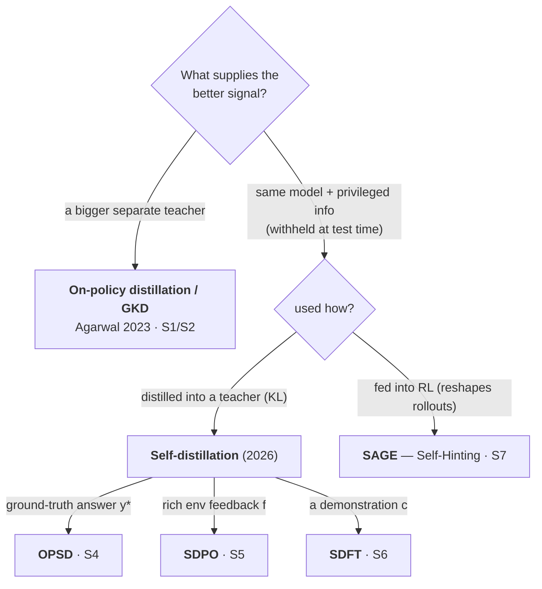

# On-Policy Distillation & the Self-Distillation Wave

## The one idea

> **Teacher = a better next-token distribution than the student. Train the student to match it with per-token KL, scored on the student's *own* (on-policy) trajectory. The teacher is a forward pass, not a decode.**

**On-policy distillation is classic *token-level* KD with one change — the data source.** Two axes place the methods: *whose tokens you train on* (rows) × *where the learning signal comes from* (columns) — a teacher's distribution to match, a reward to maximize, or the tokens to imitate:

| whose tokens ↓ \ signal from → | **a teacher** — *match its distribution* | **a reward** — *maximize it* | **the tokens** — *imitate them* |
|---|---|---|---|
| **fixed corpus** (off-policy) | token-level KD | — | SFT / MLE |
| **teacher-decoded** (off-policy) | token-level KD (on teacher samples) | — | sequence-level KD (Kim & Rush) |
| **student rollout** (on-policy) | **on-policy distillation** (OPSD, SDPO) | RL (GRPO, PPO) | rejection sampling / STaR |

The columns are three signal sources. **On-policy distillation and RL share the student-rollout row** — same on-policy data, differing only by column: a **teacher's** distribution vs the **self** tilted by **reward**. The reward column is empty off-policy (you can only tilt a distribution you're sampling from). The **tokens** column is imitation — CE on trusted tokens: corpus → SFT, teacher decode → sequence-level KD, reward-filtered rollouts → rejection sampling. Whether the teacher and reward columns are the same KL move with different priors is the RL-as-inference open thread.

Going on-policy buys what the off-policy rows can't: it **fixes exposure bias** — only the on-policy row trains the model in the contexts it actually produces at inference; the off-policy rows never correct it there, regardless of column. Its other edge over RL — a far denser signal — is a property of the *column*, not the row.

## Why it matters: the empty cell

Post-training on two axes — *who generates the data* and *how dense the signal is* (S2's 3-cell taxonomy, with the PRM row added as the known midpoint):

| | Sampling | Signal density |
|---|---|---|
| **SFT** | off-policy | dense — O(N), one-hot per token |
| **RL**, outcome reward | on-policy | **sparse** — O(1)/episode |
| **RL**, process reward (PRM) | on-policy | mid — O(#steps) |
| **On-policy distillation** | on-policy | **dense** — O(N·V), full distribution per token ← the cell everyone is now filling |

SFT is dense but off-policy; RL is on-policy but sparse. The on-policy-**and**-dense corner sat empty — on-policy distillation is what fills it.

- **O(N·V) from one forward pass.** A transformer scores every position in parallel, so one teacher pass emits a full next-token distribution — all V vocab logits — at each of the N tokens, no decode. A reward is just a scalar (O(1) outcome, O(#steps) process), so even at #steps ≈ N distillation carries a factor of V more per position.
- **What the density buys.** A target at every token cuts gradient noise, works at small batch sizes, and needs no finished rollout to score — unlike a terminal reward.
- **Measured payoff** (S2): an RL-trained policy re-learned via on-policy distillation in **~7–10× fewer gradient steps (~50–100× compute)**; Qwen3 reported **74.4% AIME via on-policy distillation vs 67.6% via RL at ~1/10 the GPU-hours** (1,800 vs 17,920) — though that last figure is quoted *from the Qwen3 report*, not measured by Thinking Machines.
- **The deepest reframe — it fixes RL's credit-assignment problem.** RL's pain is "which of my 5,000 tokens caused the failure?" A teacher conditioned on the answer just *tells you*, per token, via the probability gap. SDPO (S5): *"GRPO assigns a constant advantage to each token; SDPO assigns an individual advantage to each next-token based on the agreement of student and teacher."*

## The variants

GKD gets its teacher from a bigger separate model. The 2026 wave instead conditions the *same* model on **privileged information** withheld at test time — and mostly distills that into a teacher the student matches (OPSD, SDPO, SDFT). **SAGE is the exception**: it spends the privileged info on RL, reshaping rollouts rather than building a teacher.

One card each:

- **OPD / GKD** (S1) — the origin. Generalizes KD on two axes: *data source* (λ: mix fixed dataset vs. student samples) and *divergence* (forward KL / reverse KL / JSD(β)). λ=0 recovers ordinary supervised KD; λ=1 is fully on-policy. Fixes exposure bias by training the student in the contexts it *actually* produces. Crucially: no backprop through sampling.
- **OPSD — Self-Distilled Reasoner** (S4) — same model; teacher gets the verified solution `y*` in context. *"The teacher won't be generating tokens — rationalization is done implicitly through one forward pass."* Forward KL, per token, on the student's rollout. Math reasoning; biggest wins at small scale (1.7B: +5.7 avg over GRPO).
- **SDPO — RL via Self-Distillation** (S5) — teacher = same model conditioned on **rich textual feedback** `f` (error messages, test output) that scalar RL throws away. Turns that feedback into a dense per-token target. Reuses GRPO's rollouts — teacher is just a parallel forward pass. Coding + science reasoning; ~4–6× faster convergence.
- **SDFT — Continual Learning** (S6) — teacher = same model conditioned on a **demonstration** `c`. Because training stays on-policy and the teacher is fixed, it accumulates skills *without catastrophic forgetting* — the thing SFT can't do. Reverse KL on student rollouts.
- **SAGE — Self-Hinting** (S7) — the model samples a compact **hint (plan/decomposition)** up front, then solves conditioned on it, to keep GRPO advantages from collapsing under sparse reward. The hint reshapes the rollout distribution; the verifier reward is unchanged.

The OPSD/SDPO/SDFT rows are the **self-distillation** insight: you may not need a separate teacher at all — condition the *same weights* on privileged information the student won't have at test time, and distill that back into the unprivileged student. This is Vapnik's old **"learning using privileged information"** finally meeting LLM post-training. (Theory survey: S3.)

## Open threads (Query/Lint fodder)

- Forward vs. reverse KL is *not* settled across the cluster: OPSD & SDPO use **forward** KL (teacher as target on the right); SDFT and the S3 survey frame self-distillation as **reverse** KL. Worth a dedicated page on what each direction buys (mode-covering vs mode-seeking) and why these papers diverge.
- Does the privileged-info teacher's *quality* bound the student? S3 notes a "bad teacher" failure mode — unresolved here.
- **PRM literature + theory** — the density spectrum above treats PRMs as the O(#steps) midpoint as established background, but no primary PRM source sits in `raw/` yet. Ingest the foundational process-supervision papers and develop the theory in its own section, including SDPO's claim (S5) that its feedback-conditioned student *is* an implicit PRM.
- **RL-as-inference unification** — the grid puts RL off to the side as a reward-tilted *self*-distribution, but S3's `π* ∝ π·exp(R/β)` says distillation's teacher-distribution and RL's reward-tilted self are the *same* KL move with different priors (a separate/privileged-self teacher vs. the reward-tilted self). Does the page's thesis — *teacher = a better distribution* — already subsume RL? Worth a dedicated treatment.

## Verification status

- **Mechanism & taxonomy:** cross-checked across S1–S7 by sub-agents reading arXiv HTML + the two blog raw texts (2026-06-06). The distillation frame (teacher = a better next-token distribution; per-token KL on on-policy rollout; teacher = forward pass) holds across S1 and S4–S6 — **high confidence**. **Correction (2026-06-06):** SAGE (S7) was initially grouped with the self-distillation methods but is RL (GRPO, verifier reward unchanged); regrouped under the shared *privileged-information* umbrella, with self-distillation the dominant-but-not-only use.
- **SAGE (S7):** self-hint mechanism (GRPO + self-sampled hint, reward unchanged) confirmed via web search + HF paper page; abstract read, full PDF not — **medium-high**.
- **Exact numbers & equations:** read off HTML/extraction, **not** primary PDF. Spot-check before external citation. Most-flagged: the 74.4 vs 67.6 AIME figure is quoted from the Qwen3 report (S2), not independently measured.
- **Not yet done:** primary PDF reads of S4–S7; the forward/reverse-KL reconciliation above.

## Evidence

Full provenance — links, IDs, authors, dates, and verbatim quotes — lives in [[on-policy-distillation-sources]] (items S1–S7). Each claim above is traceable to a labeled source there.
