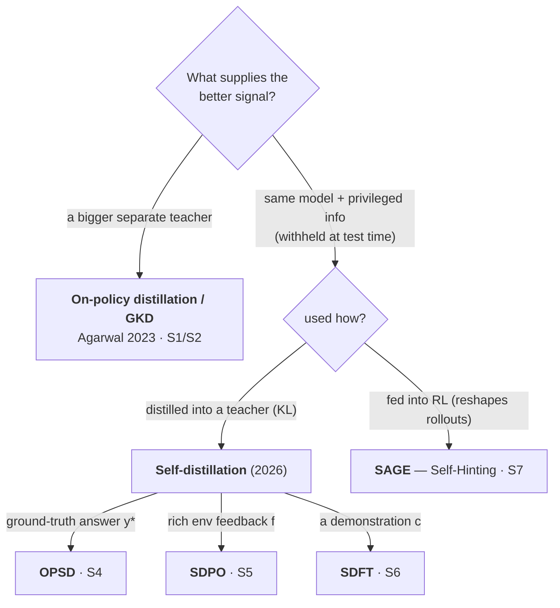

# On-Policy Distillation & the Privileged-Information Wave

## The one idea

> **Teacher = a better next-token distribution than the student. Train the student to match it with per-token KL, scored on the student's *own* (on-policy) trajectory. The teacher is a forward pass, not a decode.**

**On-policy distillation is classic *token-level* KD with one structural change — the data source.** The KL direction is a separate dial, because a token-level loss carries **two** expectations on different objects:

- **Outer expectation → the data axis.** *Over which sequences/contexts* you train — the on/off-policy choice and its exposure-bias argument.
- **Inner per-token divergence → the KL-direction dial.** *How* you match the target at each context (mode-covering vs mode-seeking). GKD is the proof they decouple: a *forward* token divergence inside an *on-policy* outer expectation (λ dials data, JSD dials direction).
- **They re-couple at the sequence level.** A *sequence*-level reverse KL is on-policy by construction (its outer `E` is over the student) — there direction ≡ data source. Separability is a per-token property.
- **They still interact.** Mode-seeking + on-policy reinforces modes the student already covers; mode-covering + on-policy explores — the data×signal interaction, not one shared axis.

Stepping back: every post-training method is two choices — **what data** (the rows) and **what signal** (the columns). The consequences sit on the axes: density and gradient from the signal, exposure bias from the data, ceiling from their interaction.

| data ↓ \ signal → | **tokens** · imitate *O(N) one-hot · backprop* | **teacher distribution** · match *O(N) full · backprop* | **reward** · maximize *O(1)–O(#steps) · policy gradient* |
|---|---|---|---|
| **fixed corpus** · off-policy *exposure unfixed* | SFT / MLE | token-level KD | — |
| **teacher decode** · off-policy *exposure unfixed* | sequence-level KD | token-level KD (teacher samples) | — |
| **student rollout** · on-policy *exposure fixed* | rejection sampling / STaR | on-policy distillation — GKD; **OPSD / SDPO / SDFT** | RL (GRPO) |

## What the two axes buy

- **Data → exposure bias.** On-policy trains the model in the contexts it actually hits at inference; off-policy can't. (Teacher-decode is the in-between — model-generated, but still the *teacher's* contexts, so it only approximates on-policy.)
- **Signal → density.** Not dimensionality — a target is V logits wide but carries ≤ log V bits ("dark knowledge"). The real win is matching the teacher's *distribution*, not one *sample*: where the truth is multi-modal (no single right token), that spread can't be recovered from hard labels. *S2: ~7–10× fewer gradient steps (~50–100× compute); Qwen3 74.4 vs 67.6 AIME at ~1/10 GPU-hours — shared 55% base, quoted from the Qwen3 report.*
- **Data × signal → ceiling.** Matching a target caps you at it (corpus / teacher / the student itself); only a reward is uncapped — so the recipe *stages* them: distill cheap to the teacher's ceiling, then RL past it.
- **Signal → gradient.** Only a black-box reward forces the **policy-gradient** estimator; everything differentiable just backprops — so on-policy ≠ RL. SDPO is distillation that merely *rewrites* its KL gradient in PG form (advantage = teacher − student) because it's pitched against GRPO. (→ RL-as-inference thread.)
- **Payoff: credit assignment.** RL smears one scalar across all ~5,000 tokens; the answer-conditioned teacher gives per-token credit. SDPO (S5): *"…an individual advantage to each possible next token … based on the agreement of student and teacher."*

## The variants

Two questions separate the variants — *where the better signal comes from*, and *how it's used*:

| variant | privileged info | KL | what's distinctive |
|---|---|---|---|
| **OPD / GKD** (S1) | — | tunable (JSD β) | separate-teacher origin; λ dials data off→on-policy; no backprop through sampling. *Summ., GSM8K.* |
| **OPSD** (S4) | answer `y*` | forward | teacher *rationalizes* from the answer in one forward pass. *Math; 1.7B +5.7 vs GRPO.* |
| **SDPO** (S5) | feedback `f` | reverse\* | replaces GRPO — turns discarded text feedback into the advantage. *Code+sci; ~4–6× faster.* |
| **SDFT** (S6) | demonstration `c` | reverse | teacher EMA-tracked; on-policy self-teaching → no catastrophic forgetting. *Continual learning.* |
| **SAGE** (S7) | self-sampled hint | — | **RL, not distillation** — the hint keeps GRPO advantages from collapsing under sparse reward; reward unchanged. |

\* forward = mode-covering, reverse = mode-seeking. SDPO is student-left (reverse under S1's convention) though its paper labels it "forward"; **which direction is best is unsettled — see Open threads.**

The OPSD/SDPO/SDFT rows are the **self-distillation** insight: you may not need a separate teacher at all — condition the *same weights* on privileged information the student won't have at test time, and distill that back into the unprivileged student. This is **generalized distillation** (Lopez-Paz, Bottou, Schölkopf & Vapnik 2015) — the distillation-specific bridge from Vapnik's older **"learning using privileged information"** — finally meeting LLM post-training. (Theory survey: S3.)

## Open threads

- **Forward vs reverse KL — researched, not settled** (S9). *Mode-covering vs mode-seeking:* forward `KL(teacher‖student)` weights the expectation under the teacher, so the student must cover all its support; reverse `KL(student‖teacher)` weights it under the student, so it peaks onto a subset. *Read-a-loss rule:* whichever distribution is the outer `E[·]` is the one whose support gets covered — ignore the paper's "forward/reverse" label, which flips with convention. *No consensus:* MiniLLM and the TM blog use **reverse** KL for on-policy distillation; GKD interpolates (JSD β, task-dependent); DistiLLM uses **skewed** KL; f-DISTILL argues **symmetric** wins; Wu et al. contrarian-claim the dichotomy *"does not hold"* (same optimum, head-vs-tail fitting order). *Still open:* does direction even matter for **self**-distillation, where teacher ≈ student and MiniLLM's void-region argument weakens? Worth a dedicated page; per-source detail in S9.
- **Does the privileged-info teacher's quality bound the student?** The ceiling row above now takes the position *yes* — distillation is capped at its teacher. What's still open is S3's **"bad teacher"** failure mode (when even the privileged-conditioned model lacks coverage of high-reward regions) and its proposed variational-EM remedy — not developed here.
- **PRM literature + theory** — the table above treats PRMs as the O(#steps) midpoint as established background, but no primary PRM source sits in `raw/` yet. Ingest the foundational process-supervision papers and develop the theory in its own section, including SDPO's claim (S5) that its feedback-conditioned student *is* an implicit PRM.
- **RL-as-inference unification** — the table treats RL as just another signal (a reward-tilted *self*-distribution), but S3's `π* ∝ π·exp(R/β)` says distillation's teacher-distribution and RL's reward-tilted self are the *same* KL move with different priors (a separate/privileged-self teacher vs. the reward-tilted self). Does the page's thesis — *teacher = a better distribution* — already subsume RL? Worth a dedicated treatment.

## Verification status

Sources read off arXiv **HTML** + blog raw text, **not** primary PDF (full provenance + the agent-extraction caveat live in [[on-policy-distillation-sources]]). The core frame — teacher = a better next-token distribution; per-token KL on the student's on-policy rollout; teacher = forward pass — is **high confidence** across S1, S4–S6. Confirm before external citation:

- **Numbers** are extraction-derived — spot-check against the PDF.
- **S3's KL is full-sequence, not per-token** — the per-token unifying thesis does not extend to it.
- **SAGE (S7)** and the **S9 forward/reverse-KL sources** were abstract/web reads, not full PDFs (S9's 2026 survey arXiv:2604.00626 is unverified) — see their source entries.

## Evidence

Full provenance — links, IDs, authors, dates, verbatim quotes — lives in [[on-policy-distillation-sources]] (S1–S9; `raw/` is the immutable evidence layer this page compresses). Every figure, equation, and quote above traces to a labeled source there; pre-2026 background citations (Kim & Rush, STaR, PPO, generalized distillation / Vapnik LUPI) are stubs (S8).
